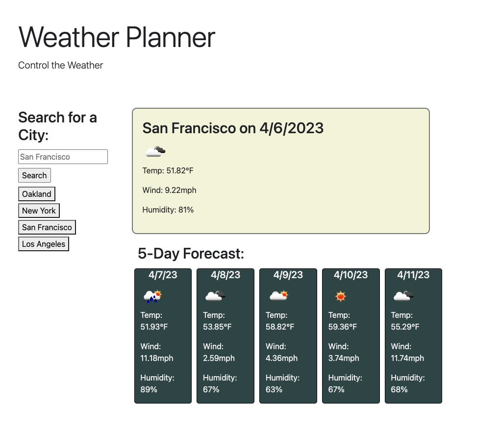

# Weather Planner

This is a small weather forecast app that lets you search for a city and displays the current weather as well as a 5-day forecast. The app also saves your search history and lets you click on any cities you previously searched for to bring up updated weather data.

## Technologies Used

- HTML
- CSS
- JavaScript
- jQuery
- Bootstrap
- OpenWeatherMap's API

## Features

- Search for a city to display current weather and 5-day forecast
- Save search history
- Click on previously searched cities to bring up updated weather data

## How to Use

1. Enter the name of a city in the search bar and press enter or click the search button.
2. The current weather and 5-day forecast for the city will be displayed.
3. Your search history will be saved and displayed below the search bar.
4. Click on any city in your search history to bring up updated weather data.

